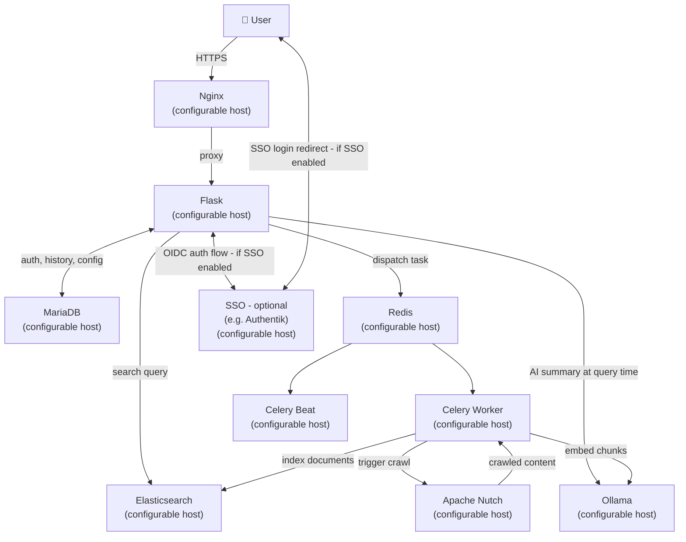
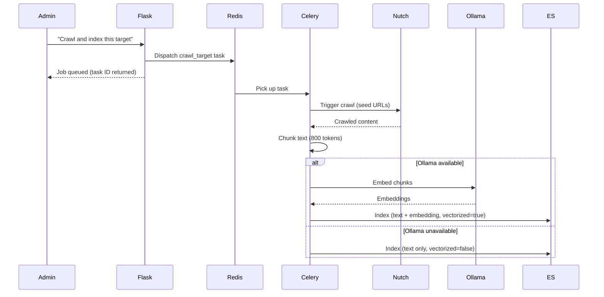
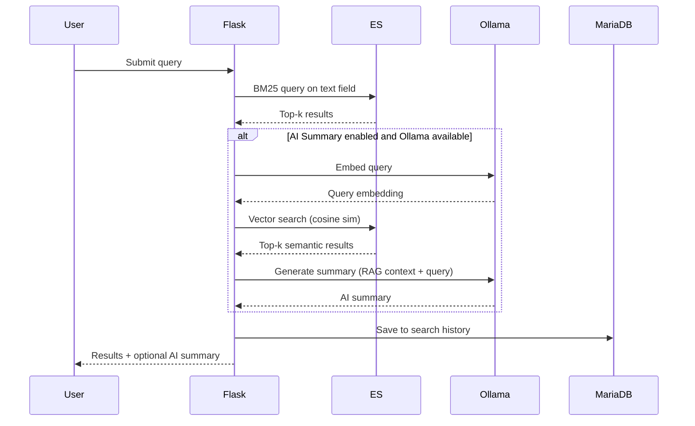
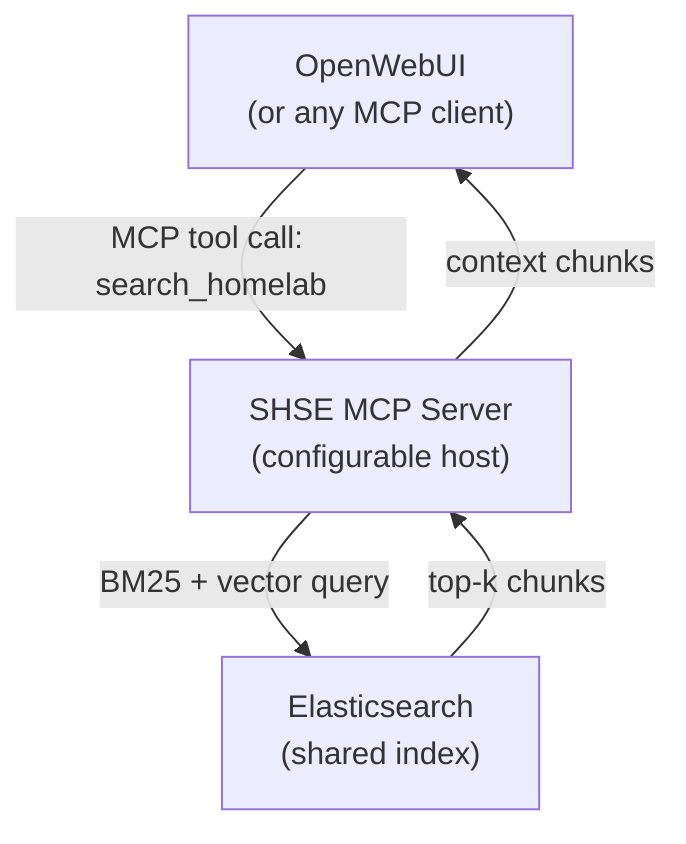

# Self-Hosted Search Engine (SHSE) — Design Document

## 1. Problem Statement

Homelab operators lack a purpose-built search engine for their internal infrastructure. Existing self-hosted search engines target internet-wide indexing; none are designed to crawl, index, and query the services, docs, and pages running on a private network. SHSE fills this gap.

---

## 2. Goals & Non-Goals

**Goals**
- BM25 full-text search over homelab-hosted content
- Optional AI-generated result summaries via local LLM (RAG)
- Configurable network/service crawling via Apache Nutch
- User accounts with persistent search history
- Declarative YAML-based crawler configuration
- Admin UI for crawl management and index operations
- Role-based access: Admin (full access) vs. User (search only)
- Optional SSO (off by default); local password auth as default

**Non-Goals**
- Internet search / public web indexing
- Full AI chat mode (deferred moonshot; OpenWebUI covers this)
- Network diagram software integration (v1 out of scope)
- MCP chat integration (post-MVP; see §13)

---

## 3. System Split

SHSE is composed of discrete, network-addressable services. Each can run on its own VM/container or be co-located — deployment topology is a configuration concern, not an architectural one. Every service endpoint (ES, MariaDB, Nutch, Ollama, Redis) is specified via environment variables or a config file.

**Logical groupings** (not required co-location):

| Group | Services |
|---|---|
| **Frontend** | Nginx, Flask |
| **Crawl-Index** | Celery Worker, Celery Beat, Redis |
| **External Services** | Apache Nutch, Ollama, Elasticsearch, MariaDB |
| **Auth (optional)** | SSO provider (e.g. Authentik, Keycloak, Authelia) |

All services are assumed to be independently hosted and reachable over the network. They may be co-located or run standalone. The SSO provider is optional; if disabled, Flask handles auth locally against MariaDB.



---

## 4. Component Breakdown

### 4.1 Flask Application

**User-facing:**
- Search UI (BM25 results + optional AI summary card)
- Login / registration
- Search history (per user)
- Settings: toggle AI summary, select Ollama model

**Admin-only (`/admin`):**
- Crawler config editor (YAML upload or inline edit)
- Target list view with per-target controls
- Crawl action buttons (see §7)
- Crawl job status dashboard
- Index management (reindex, vectorize deferred docs)
- System health indicators (ES, Nutch, Ollama, Redis connectivity)

### 4.2 Elasticsearch

Single index with the following core fields:

| Field | Type | Notes |
|---|---|---|
| `url` | keyword | Source URL |
| `port` | integer | Source port |
| `text` | text | Chunk content (BM25 target) |
| `embedding` | dense_vector | Cosine similarity; `null` if deferred |
| `title` | text | Page title from Nutch |
| `crawled_at` | date | Ingest timestamp |
| `service_nickname` | keyword | User-defined label |
| `content_type` | keyword | MIME type |
| `vectorized` | boolean | False until Ollama processes the chunk |

- **Chunk size**: 800 tokens
- **Deferred vectorization**: `vectorized: false` + `embedding: null` on initial index; backfilled by Celery when Ollama is available

### 4.3 Apache Nutch

- Deployed on the Crawl-Index VM
- Celery triggers crawls via Nutch REST API
- Nutch outputs crawled text + metadata; Celery consumes and pipelines to ES
- TLS handling: see §8

### 4.4 Celery + Redis

Celery workers on the Crawl-Index VM handle all async heavy work:

| Task | Trigger |
|---|---|
| `crawl_target(target_id)` | Admin button: "Crawl this target" |
| `crawl_all()` | Admin button: "Crawl all targets" |
| `reindex_target(target_id)` | Admin button: "Reindex this target" |
| `reindex_all()` | Admin button: "Reindex all (wipe + rebuild)" |
| `vectorize_pending()` | Admin button: "Vectorize deferred documents" |
| `scheduled_crawl()` | Celery Beat (cron-based, from crawler config schedules) |

Redis serves as the Celery broker. Flask dispatches tasks by connecting to Redis directly — no Celery worker runs on the Search System VM.

### 4.5 Ollama

Two roles:
1. **Embedding model** (e.g., `nomic-embed-text`): called during indexing and deferred vectorization
2. **Generative model** (e.g., `llama3`, `mistral`): called at query time for AI summaries

Flask calls Ollama directly at query time (for summaries). Celery calls Ollama during indexing (for embeddings). If Ollama is unreachable, indexing proceeds with `vectorized: false`; search falls back to BM25-only.

### 4.6 MariaDB

| Table | Contents |
|---|---|
| `users` | Credentials, role (`admin`/`user`), SSO identity if applicable |
| `search_history` | Query, timestamp, user_id |
| `crawler_targets` | Parsed target config (YAML source stored as blob + parsed fields) |
| `crawl_jobs` | Job ID, task ID, target_id, status, started_at, finished_at |

### 4.7 Nginx

- TLS termination
- Reverse proxy to Flask
- Restricts `/admin/*` routes to admin role (or handled in Flask — do both for defense in depth)

---

## 5. Authentication

### Default: Local Password Auth
- Username + hashed password (bcrypt) stored in MariaDB
- Session-based auth via Flask-Login
- Role field on the `users` table: `admin` or `user`
- First-run setup creates the initial admin account
- Active when `SSO_ENABLED=false` (default)
- Can remain enabled alongside SSO via `AUTH_LOCAL_ENABLED=true`

### Optional: SSO (disabled by default)
- Enabled via `SSO_ENABLED=true`
- OIDC-compatible providers — Authentik, Keycloak, Authelia are all common in large homelabs
- Implementation: `Authlib` (Flask OIDC client)
- Auth flow: user is redirected to the SSO provider login page; on success, Flask receives an OIDC token and provisions/updates the local user record in MariaDB
- Role assignment: mapped from OIDC claims (e.g. Authentik group → SHSE role) or manually set by admin in MariaDB
- When SSO is enabled, local auth can be left on (for fallback/admin recovery) or disabled entirely

---

## 6. Crawler Configuration Format

YAML. INI/ConfigParser cannot represent nested structures (schedule blocks, typed targets) without awkward workarounds.

```yaml
defaults:
  service: http
  port: 80
  route: /
  schedule:
    frequency: weekly
    day: sunday
    time: "02:00"
    timezone: UTC
  tls_verify: true  # set false per-target for self-signed certs

targets:
  - type: network
    network: 192.168.1.0/24
    schedule:
      frequency: weekly
      day: sunday
      time: "02:00"
      timezone: America/New_York

  - type: service
    nickname: myblog
    url: blog.homelab.lan
    ip: 192.168.1.23
    service: http
    port: 80
    route: /
    tls_verify: false   # override for self-signed cert
    schedule:
      frequency: monthly
      day: 1
      time: "01:00"
      timezone: America/New_York
```

Any omitted field inherits from the `defaults` block, which itself falls back to the built-in defaults shown above.

---

## 7. Admin UI — Crawl Controls

| Button | Action | Scope |
|---|---|---|
| Crawl this target | `crawl_target(id)` | Single target |
| Crawl all targets | `crawl_all()` | All targets |
| Reindex this target | Delete ES docs for target → re-crawl → re-index | Single target |
| Reindex all | Wipe ES index → crawl all → index all | Full index |
| Vectorize deferred docs | `vectorize_pending()` — finds `vectorized: false`, batches through Ollama | Full index |
| Check job status | Poll Celery task state via task ID stored in `crawl_jobs` | Per-job |

All buttons are disabled with a warning if the relevant service (Nutch, Ollama, ES) is unreachable.

---

## 8. TLS / Self-Signed Certificate Handling

Homelab services commonly use self-signed certs. Two layers need handling:

**Nutch (crawling HTTPS targets):**
- Nutch's HTTP plugin respects `http.timeout` and TLS settings in `nutch-site.xml`
- SHSE will generate a `nutch-site.xml` patch that disables hostname verification when `tls_verify: false` is set on a target
- Long-term recommended approach: mount your homelab CA cert into the Nutch container's JVM trust store (`cacerts`)

**Flask (internal service calls to ES, Ollama, Nutch):**
- Per-service `verify=False` on `requests` calls when configured
- Global flag `INTERNAL_TLS_VERIFY = false` available for fully trusted LAN environments
- Admin UI shows a warning banner when TLS verification is disabled anywhere

**Recommendation in docs:** Add your homelab CA to container trust stores rather than disabling verification. Disabling is a dev/bootstrap convenience, not a permanent configuration.

---

## 9. Data Flows

### 9.1 Crawl & Index Pipeline



### 9.2 Deferred Vectorization


### 9.3 Search & Retrieval



---

## 10. Deployment

Each service has its own Docker Compose file or can be added to an existing stack. SHSE ships a reference `docker-compose.yml` that co-locates everything, plus documented environment variables so any service can be pointed at an external host instead.

Example config surface (`.env` or config file):

```ini
FLASK_HOST=0.0.0.0
FLASK_PORT=5000

MARIADB_HOST=192.168.1.10
MARIADB_PORT=3306

ES_HOST=192.168.1.20
ES_PORT=9200

REDIS_HOST=192.168.1.30
REDIS_PORT=6379

NUTCH_HOST=192.168.1.40
NUTCH_PORT=8080

OLLAMA_HOST=192.168.1.50
OLLAMA_PORT=11434

# SSO — leave blank to disable
SSO_ENABLED=false
SSO_PROVIDER_URL=https://authentik.homelab.lan
SSO_CLIENT_ID=
SSO_CLIENT_SECRET=
```

**Resource notes:**
- Elasticsearch: set `ES_JAVA_OPTS=-Xms1g -Xmx1g` minimum; increase for large indexes
- Ollama: GPU passthrough strongly recommended for acceptable embedding throughput
- Celery Beat handles all scheduled crawls from the YAML config; no external cron needed

---

## 11. Out of Scope (v1)

- Expand AI / chat mode — future moonshot project
- Network diagram software config import
- Per-user crawler config (v1: admin-managed global config)
- HTTPS crawling of self-signed certs via CA trust store automation (manual setup documented)

---

## 13. MCP Integration (Post-MVP)

### Overview

After MVP, SHSE can expose its search index as an MCP (Model Context Protocol) tool. This allows any MCP-compatible client — OpenWebUI, Continue, or any other local AI frontend — to query the homelab index as a context source for a local model, without any changes to the core crawl-index pipeline.

### Architecture

A small, standalone MCP server wraps the existing ES query logic and exposes it as an MCP tool. It is a separate service with its own configurable host entry.



### MCP Server

- Lightweight FastAPI service
- Exposes a single MCP tool: `search_homelab(query: str) -> list[str]`
- Internally runs the same BM25 + optional vector query already used by Flask
- Returns top-k text chunks as context strings for the calling model
- Stateless — no DB dependency, connects only to ES

### Deployment

Add to `.env`:

```ini
MCP_HOST=0.0.0.0
MCP_PORT=8100
```

Add to `docker-compose.yml` as an optional service. The MCP server shares the ES endpoint config with the rest of the stack.

### Prerequisites

This section is intentionally deferred until after MVP. The following must be complete first:
- ES index and query logic (Sprint 3)
- Ollama embedding + vector search (Sprint 8)

No changes to the crawl-index pipeline or Flask app are required.

1. **Nutch version**: 1.x server mode vs. 2.x — different REST APIs. Confirm before starting Nutch integration.
2. **ES hosting**: On Search VM, Crawl-Index VM, or its own VM? Affects network topology and latency for both systems.
3. **Celery Beat persistence**: Beat's schedule state is in-memory by default; use `django-celery-beat` DB backend or a flat file schedule to survive restarts.