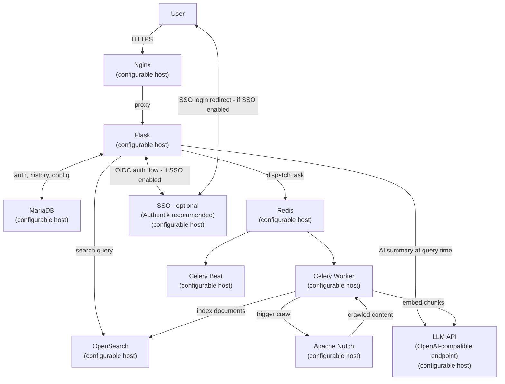
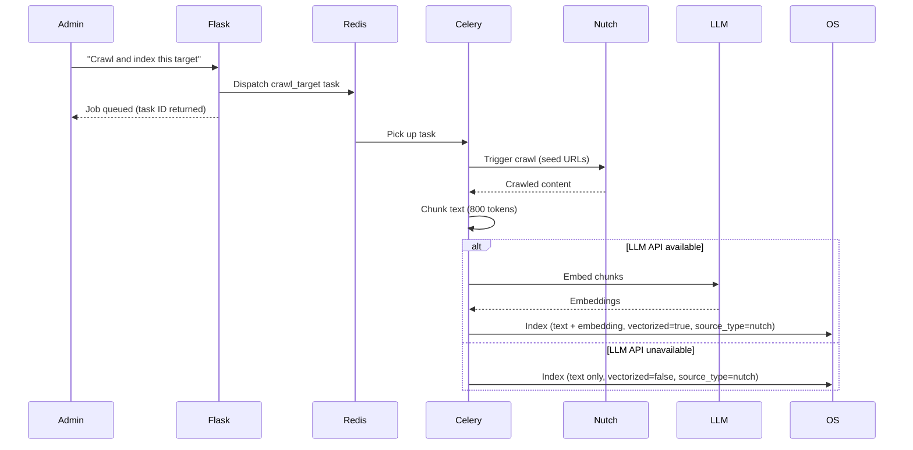
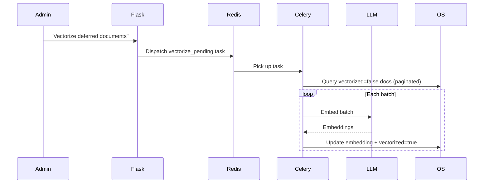
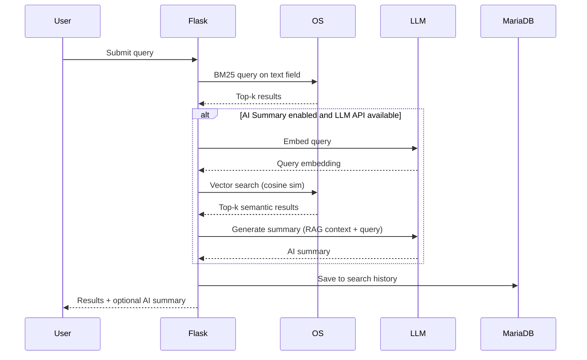
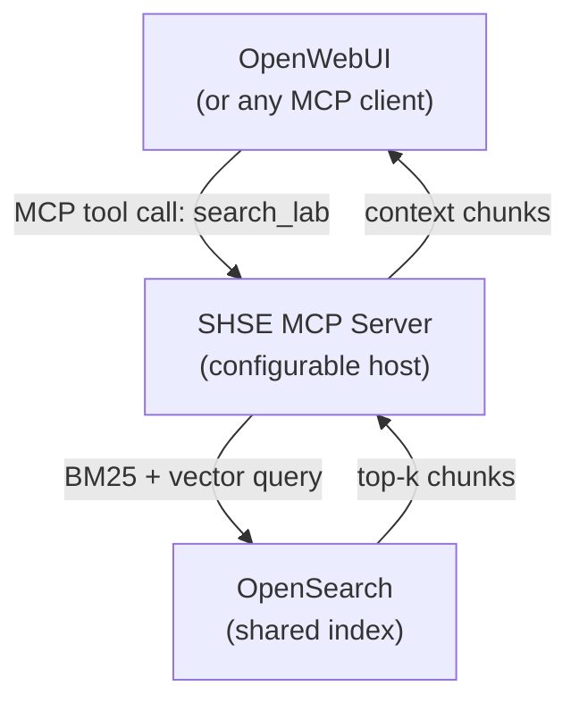

# Self-Hosted Search Engine (SHSE) — Design Document

---

## 1. Problem Statement

Homelab operators lack a purpose-built search engine for their internal infrastructure. Existing self-hosted search engines target internet-wide indexing; none are designed to crawl, index, and query the services, docs, and pages running on a private network. SHSE fills this gap.
---

## 2. Goals & Non-Goals

**Goals**
- BM25 full-text search over lab-network-hosted content with typo tolerance
- Optional AI-generated result summaries via local LLM (RAG)
- Configurable network/service crawling via Apache Nutch
- User accounts with persistent search history
- Declarative YAML-based crawler configuration
- Admin UI for crawl management and index operations
- Role-based access: Admin (full access) vs. User (search only)
- Optional SSO (off by default); local password auth as default
- Index only genuinely public content — content visible to an unauthenticated visitor
- **Idempotent ingestion**: re-running any crawl or harvest against already-indexed content produces no duplicates and no data loss; existing documents are updated in place, not appended

**Non-Goals**
- Internet search / public web indexing
- Full AI chat mode (deferred moonshot; OpenWebUI covers this)
- Network diagram software integration (v1 out of scope)
- MCP chat integration (post-MVP; see §13)
- Crawling authenticated or private content under any circumstances

---

## 3. System Split

SHSE is composed of discrete, network-addressable services. Each can run on its own VM/container or be co-located — deployment topology is a configuration concern, not an architectural one. Every service endpoint (OpenSearch, MariaDB, Nutch, LLM API, Redis) is specified via environment variables or a config file.

**Logical groupings** (not required co-location):

| Group | Services |
|---|---|
| **Frontend** | Nginx, Flask |
| **Crawl-Index** | Celery Worker, Celery Beat, Redis |
| **External Services** | Apache Nutch, LLM API endpoint, OpenSearch, MariaDB |
| **Auth (optional)** | SSO provider — Authentik is the stack default |

All services are assumed to be independently hosted and reachable over the network. The SSO provider is optional; if disabled, Flask handles auth locally against MariaDB. When deployed into the university lab stack, Authentik is the expected SSO provider.



---

## 4. Component Breakdown

### 4.1 Flask Application

**User-facing:**
- Search UI (BM25 results + optional AI summary card)
- Login / registration
- Search history (per user)
- Settings: toggle AI summary, select LLM model

**Admin-only (`/admin`):**
- Crawler config editor (YAML upload or inline edit)
- Target list view with per-target controls
- Crawl action buttons (see §7)
- Crawl job status dashboard
- Index management (reindex, vectorize deferred docs)
- System health indicators (OpenSearch, Nutch, LLM API, Redis connectivity)

### 4.2 OpenSearch

#### Search quality

SHSE targets **typo-tolerant, multi-field BM25** as the baseline retrieval strategy:

- **Typo tolerance** — `fuzziness: AUTO` on match queries (1 edit distance for 3–5 char terms, 2 for 6+). The first character is never fuzzed (`prefix_length: 1`) to avoid excessively broad matches.
- **Multi-field retrieval** — queries match against both `text` (chunk content) and `title` (page title) simultaneously using OpenSearch `multi_match best_fields`; `title` is boosted (`title^2`) so title matches rank above body matches.
- **Semantic re-ranking** — when the LLM API is available, the query is also embedded and run as a k-NN search to surface semantically related results alongside BM25 hits.

No additional OpenSearch plugins are required for baseline typo tolerance. Phonetic matching (Soundex/Metaphone via the `analysis-phonetic` plugin) is a possible future enhancement if homophone confusion becomes a problem in practice.

Single index with the following core fields:

| Field | Type | Notes |
|---|---|---|
| `url` | keyword | Source URL |
| `port` | integer | Source port |
| `text` | text | Chunk content (BM25 target) |
| `embedding` | dense_vector | Cosine similarity; `null` if deferred |
| `title` | text | Page title from Nutch |
| `crawled_at` | date | Ingest timestamp |
| `service_nickname` | keyword | User-defined label |
| `content_type` | keyword | MIME type |
| `vectorized` | boolean | False until LLM API processes the chunk |
| `source_type` | keyword | `nutch`, `oai-pmh`, `rss`, `api-push` — tracks ingestion path |
| `content_hash` | keyword | SHA-256 of normalized `text`; used for idempotent upsert and change detection |

- **Chunk size**: 800 tokens
- **Deferred vectorization**: `vectorized: false` + `embedding: null` on initial index; backfilled by Celery when LLM API is available
- **Document identity**: each chunk is identified by a deterministic ID derived from `sha256(url + chunk_index)`. All OpenSearch writes use `_index` with this ID, making every write an upsert. A chunk whose `content_hash` has not changed since the last crawl is skipped entirely — no re-embedding, no re-write.
- **Stale document removal**: at the end of each crawl run for a target, any document in OpenSearch with a `crawled_at` older than the run start timestamp and matching `service_nickname` is deleted. This handles page removals and URL changes without a full reindex.

OpenSearch also serves as the SIEM and log backend for the broader lab stack. The SHSE index is a distinct named index within the same OpenSearch cluster — no resource conflict, shared infrastructure.

### 4.3 Apache Nutch

- Deployed on the Crawl-Index VM
- Celery triggers crawls via Nutch REST API
- Nutch outputs crawled text + metadata; Celery consumes and pipelines to OpenSearch
- **Nutch is the primary ingestion path for standard HTML content only** — see §11 for the full breakdown of what Nutch handles vs. what requires supplementary pipelines
- TLS handling: see §8
- Apache Tika is deployed alongside Nutch as a plugin; handles PDF, DOCX, PPTX, and ODT text extraction transparently for any file URL encountered during crawl

### 4.4 Celery + Redis

Celery workers on the Crawl-Index VM handle all async heavy work:

| Task | Trigger |
|---|---|
| `crawl_target(target_id)` | Admin button: "Crawl this target" |
| `crawl_all()` | Admin button: "Crawl all targets" |
| `reindex_target(target_id)` | Admin button: "Reindex this target" |
| `reindex_all()` | Admin button: "Reindex all (wipe + rebuild)" |
| `vectorize_pending()` | Admin button: "Vectorize deferred documents" |
| `scheduled_crawl()` | Celery Beat (cron-based, from crawler config schedules) |
| `harvest_oai(target_id)` | Scheduled or manual; runs Metha OAI-PMH harvest |
| `harvest_feeds(target_id)` | Scheduled or manual; ingests RSS/Atom/ActivityPub feeds |
| `push_api_content(target_id)` | Scheduled; pulls from service APIs and pushes normalized docs |

Redis serves as the Celery broker. Flask dispatches tasks by connecting to Redis directly — no Celery worker runs on the Search System VM.

### 4.5 LLM API

SHSE communicates with a single **OpenAI-compatible HTTP endpoint** configured via `LLM_API_BASE`. In the university lab stack this is **LiteLLM**, which proxies to Triton Inference Server (primary) or Ollama (fallback). Any OpenAI-compatible endpoint works; SHSE has no runtime dependency on a specific backend.

Two roles:
1. **Embedding model**: called during indexing and deferred vectorization; configured via `LLM_EMBED_MODEL` (e.g. `nomic-embed-text`)
2. **Generative model**: called at query time for AI summaries; configured via `LLM_GEN_MODEL` (e.g. `llama3`, `mistral`)

If the LLM API is unreachable, indexing proceeds with `vectorized: false`; search falls back to BM25-only. No hard dependency on GPU availability.

### 4.6 MariaDB

| Table | Contents |
|---|---|
| `users` | Credentials, role (`admin`/`user`), SSO identity if applicable |
| `search_history` | Query, timestamp, user_id |
| `crawler_targets` | Parsed target config (YAML source stored as blob + parsed fields) |
| `crawl_jobs` | Job ID, task ID, target_id, status, started_at, finished_at |

MariaDB here is the lab's shared MariaDB instance. SHSE uses a dedicated database within that instance — not a separate server.

### 4.7 Nginx

- TLS termination
- Reverse proxy to Flask
- Restricts `/admin/*` routes to admin role (also enforced in Flask — defense in depth)

---

## 5. Authentication

### Default: Local Password Auth
- Username + hashed password (bcrypt) stored in MariaDB
- Session-based auth via Flask-Login
- Role field on the `users` table: `admin` or `user`
- First-run setup creates the initial admin account
- Active when `SSO_ENABLED=false` (default)
- Can remain enabled alongside SSO via `AUTH_LOCAL_ENABLED=true`

### Optional: SSO
- Enabled via `SSO_ENABLED=true`
- OIDC-compatible providers — **Authentik is the expected provider in the lab stack**; Keycloak and Authelia also supported
- Implementation: `Authlib` (Flask OIDC client)
- Auth flow: user redirected to SSO provider; on success Flask receives OIDC token and provisions/updates local user record in MariaDB
- Role assignment: mapped from OIDC claims (e.g. Authentik group → SHSE role) or manually set by admin
- When SSO is enabled, local auth can remain on for fallback/admin recovery or be disabled entirely

---

## 6. Crawler Configuration Format

YAML. INI/ConfigParser cannot represent nested structures (schedule blocks, typed targets) without awkward workarounds.

```yaml
defaults:
  service: http
  port: 80
  route: /
  schedule:
    frequency: weekly
    day: sunday
    time: "02:00"
    timezone: UTC
  tls_verify: true  # set false per-target for self-signed certs

targets:
  - type: network
    network: 192.168.1.0/24
    schedule:
      frequency: weekly
      day: sunday
      time: "02:00"
      timezone: America/New_York

  - type: service
    nickname: discourse
    url: discourse.lab.internal
    ip: 10.0.0.51
    service: http
    port: 80
    route: /
    tls_verify: false
    schedule:
      frequency: daily
      time: "03:00"
      timezone: UTC

  - type: oai-pmh
    nickname: invenio-rdm
    url: invenio.lab.internal
    endpoint: /oai2d
    schedule:
      frequency: daily
      time: "04:00"
      timezone: UTC

  - type: feed
    nickname: ghost-blog
    url: blog.lab.internal
    feed_path: /rss
    schedule:
      frequency: daily
      time: "04:30"
      timezone: UTC
```

Target types: `network`, `service` (Nutch crawl), `oai-pmh` (Metha harvest), `feed` (RSS/Atom/ActivityPub), `api-push` (custom adapter script). Any omitted field inherits from `defaults`.

---

## 7. Admin UI — Crawl Controls

| Button | Action | Scope |
|---|---|---|
| Crawl this target | `crawl_target(id)` | Single target |
| Crawl all targets | `crawl_all()` | All targets |
| Reindex this target | Delete OpenSearch docs for target → re-crawl → re-index | Single target |
| Reindex all | Wipe OpenSearch index → crawl all → index all | Full index |
| Vectorize deferred docs | `vectorize_pending()` — finds `vectorized: false`, batches through LLM API | Full index |
| Check job status | Poll Celery task state via task ID stored in `crawl_jobs` | Per-job |

All buttons disabled with a warning if the relevant service (Nutch, LLM API, OpenSearch) is unreachable.

---

## 8. TLS / Self-Signed Certificate Handling

**Nutch (crawling HTTPS targets):**
- Nutch's HTTP plugin respects TLS settings in `nutch-site.xml`
- SHSE generates a `nutch-site.xml` patch disabling hostname verification when `tls_verify: false` on a target
- Recommended: mount the lab's internal CA cert (issued by Vault/step-ca) into the Nutch container's JVM trust store (`cacerts`)

**Flask (internal service calls to OpenSearch, LLM API, Nutch):**
- Per-service `verify=False` on `requests` calls when configured
- Global flag `INTERNAL_TLS_VERIFY=false` available for fully trusted LAN environments
- Admin UI shows a warning banner when TLS verification is disabled anywhere

**Lab stack note:** The lab uses Vault + step-ca as the internal PKI. Mounting the step-ca root cert into all SHSE containers eliminates the need for `tls_verify: false` on any internally-issued cert.

---

## 9. Data Flows

### 9.1 Crawl & Index Pipeline (Nutch path)



### 9.2 Deferred Vectorization



### 9.3 Search & Retrieval



---

## 10. Deployment

Each service has its own Docker Compose file or can be added to an existing stack. SHSE ships a reference `docker-compose.yml` that co-locates everything, plus documented environment variables so any service can be pointed at an external host.

```ini
FLASK_HOST=0.0.0.0
FLASK_PORT=5000

MARIADB_HOST=db-maria.lab.internal
MARIADB_PORT=3306

OPENSEARCH_HOST=opensearch.lab.internal
OPENSEARCH_PORT=9200

REDIS_HOST=redis.lab.internal
REDIS_PORT=6379

NUTCH_HOST=nutch.lab.internal
NUTCH_PORT=8080

# LLM API — any OpenAI-compatible endpoint
# Lab stack: point at LiteLLM, which routes to Triton or Ollama
LLM_API_BASE=http://litellm.lab.internal:4000
LLM_EMBED_MODEL=nomic-embed-text
LLM_GEN_MODEL=llama3

# SSO — leave blank to disable
SSO_ENABLED=false
SSO_PROVIDER_URL=https://auth.lab.internal
SSO_CLIENT_ID=
SSO_CLIENT_SECRET=
```

**Resource notes:**
- OpenSearch: `OPENSEARCH_JAVA_OPTS=-Xms1g -Xmx1g` minimum; increase for large research corpora
- LLM embedding throughput: GPU passthrough on the Triton/Ollama host strongly recommended; BM25-only fallback is always available
- Celery Beat handles all scheduled crawls; no external cron needed

---

## 11. Ingestion Coverage — What Gets Indexed and How

This section maps the university lab service stack to ingestion paths. The goal is anonymous-public-only indexing: content is in the index if and only if it is visible to an unauthenticated visitor.

### Nutch native crawl (HTML, no auth)

These services expose standard HTML to anonymous visitors and are crawled directly.

| Service | Notes |
|---|---|
| **Discourse** | Public forums and topics; `/latest` and category pages |
| **Lemmy** | Public communities and posts; ActivityPub HTML |
| **Mastodon / Akkoma** | Public timelines and profiles |
| **PeerTube** | Public video pages; captions handled separately (see feed path) |
| **Ghost / WordPress / Writefreely / Plume** | Published blog posts; HTML + RSS |
| **Castopod** | Episode pages and RSS |
| **DSpace / EPrints / Invenio RDM** | Public repository record pages; OAI-PMH path is richer (see below) |
| **Koha OPAC** | Public library catalog pages |
| **Kiwix-serve** | All ZIM content (Wikipedia, StackOverflow, Khan Academy, etc.) |
| **Wiki.js / BookStack** | Pages explicitly marked public by admin |
| **Forgejo** | Public repositories and wiki pages; private repos return 404 to anonymous requests |
| **Answer** | Public Q&A if instance is configured as open |
| **Canvas / Moodle** | Public course catalog and syllabi only — admin must explicitly publish; nothing else crawled |
| **Invidious / Redlib / Scribe / Lingva** | Anonymous frontends; fully crawlable by design |

### Supplementary ingestion pipelines (Celery workers, Airflow-orchestrated)

These sources require a purpose-built pipeline beyond Nutch. All pipelines normalize to the same document schema `{title, body, url, source, date, source_type}` before pushing to OpenSearch.

| Source | Pipeline | Reason |
|---|---|---|
| **DSpace / EPrints / Invenio RDM / Koha** | **Metha** OAI-PMH harvester → OpenSearch push | Structured metadata, incremental harvest; far richer than HTML crawl |
| **Ghost / WordPress / Castopod / PeerTube / Discourse** | RSS/Atom feed harvester | Incremental update awareness; Nutch crawl as broad sweep, feeds for freshness |
| **Mastodon / Lemmy / PeerTube / Akkoma** | ActivityPub outbox consumer | Captures federated content beyond local instance HTML |
| **PeerTube / Jellyfin (public libraries)** | Caption/subtitle puller (VTT/SRT via API) | Makes video content full-text searchable by transcript |
| **Forgejo** | Forgejo REST API → README + wiki extractor | Ensures repo wikis and READMEs index with full structure |
| **PDF/DOCX in public repositories** | Apache Tika plugin on Nutch | Transparent extraction during crawl; no separate pipeline needed |

### Publish-to-index pattern (admin action required)

These services have valuable content but no natural public surface. The correct approach is a deliberate publish step by service admins, after which Nutch crawls normally.

| Service | Recommended publish pattern |
|---|---|
| **Paperless-ngx** | Export specific research reports to a public static directory or Ghost post |
| **Outline** | Designate a public-facing section; everything else stays private |
| **Photoprism / Immich** | Use share album feature to generate public URLs |
| **Jellyfin** | Mark specific libraries as public; Nutch crawls media detail pages |
| **Canvas / Moodle** | Publish course syllabi and reading lists as public HTML pages |

### Permanently excluded

All infrastructure and admin tools, all authenticated-only services, all chat history, all SecOps tooling, all databases, all email. These have no public surface by design and must not be indexed.

---

## 12. Out of Scope (v1)

- Expanded AI / chat mode — future moonshot; OpenWebUI covers interactive chat
- Network diagram software config import
- Per-user crawler config (v1: admin-managed global config)
- HTTPS crawling via CA trust store automation (manual setup documented)
- Nutch failure cases for SPA and non-HTML content — see §14

---

## 13. MCP Integration (Post-MVP)

### Overview

After MVP, SHSE exposes its search index as an MCP tool. Any MCP-compatible client — OpenWebUI, Continue, or any local AI frontend — can query the lab index as a context source without changes to the core crawl-index pipeline.

### Architecture

A small standalone MCP server wraps the existing OpenSearch query logic and exposes it as an MCP tool.



### MCP Server

- Lightweight FastAPI service
- Exposes a single MCP tool: `search_lab(query: str) -> list[str]`
- Internally runs the same BM25 + optional vector query already used by Flask
- Returns top-k text chunks as context strings for the calling model
- Stateless — no DB dependency; connects only to OpenSearch

### Deployment

```ini
MCP_HOST=0.0.0.0
MCP_PORT=8100
```

Added to `docker-compose.yml` as an optional service. Shares OpenSearch endpoint config with the rest of the stack.

**Prerequisites:** OpenSearch index and query logic (Sprint 3) and Ollama embedding + vector search (Sprint 8) must be complete first.

---

## 14. Stretch Goal — Supplementary Ingestion for Nutch-Insufficient Sources

> This section is out of scope for v1. It documents service categories where Nutch alone cannot produce adequate index coverage, and proposes purpose-built ingestion pipelines for each.

The common thread across all cases here is that Nutch is an anonymous HTTP client: it cannot authenticate, it cannot execute JavaScript, and it cannot interpret binary media. Where these constraints eliminate an otherwise indexable public surface, a supplementary Celery pipeline fills the gap. All pipelines normalize to the same document schema and use the same idempotent upsert semantics as the Nutch path.

---

### Services with a public surface that require a structured API

These services have genuine public content but their HTML is either a SPA shell (no rendered text for Nutch to extract) or structurally poor compared to what their API provides.

| Service | Problem | Proposed pipeline |
|---|---|---|
| **Forgejo** | Repo wikis and issue comments are HTML but deep pagination; API gives structured content cleanly | Forgejo REST API → extract public repo README, wiki pages, and issue titles/bodies → upsert to OpenSearch |
| **PeerTube** | Video pages index fine; caption/subtitle files (VTT/SRT) are binary and skipped by Nutch | PeerTube API → fetch caption files for public videos → extract plaintext → upsert alongside video page document |
| **Jellyfin (public libraries)** | Media metadata API is far richer than the HTML detail page | Jellyfin API → extract title, description, tags, genre for public library items → upsert as metadata documents |
| **Discourse** | HTML crawl works but JSON API gives structured topic/post data with correct threading | Supplement Nutch crawl with Discourse `/latest.json` + `/t/{id}.json` for fresher, structured content |
| **Canvas / Moodle** | Publicly published course pages are HTML-crawlable but LMS APIs expose cleaner course metadata | LMS REST API → extract public course title, description, and syllabus → upsert; Nutch still handles full page crawl |
| **DSpace / EPrints / Invenio RDM / Koha** | HTML OPAC/record pages crawlable but OAI-PMH gives structured metadata, abstracts, and incremental harvest | Metha OAI-PMH harvester (already in §11 main pipeline); listed here for completeness as the API path supersedes Nutch for these sources |

---

### Services with no public HTML surface but a public-accessible API

These have valuable content with no anonymous HTML surface at all. Indexing requires a read-only service account — the account must only have access to content that is explicitly marked public by the service admin.

| Service | Problem | Proposed pipeline |
|---|---|---|
| **Outline** | React SPA; no SSR; all content behind auth even if workspace is set to public | Read-only Outline API token scoped to public collections only → extract document title + body → upsert |
| **Zulip** | All messages behind auth; no public archive | Read-only bot account in public streams only → Zulip REST API → extract public stream messages → upsert. Private channels must be explicitly excluded in config. |
| **Continuwuity / Matrix** | No public HTML archive; client-server API required | Read-only Matrix bot in public rooms only → Client-Server API → extract public room messages → upsert. Private/encrypted rooms must never be accessed. |

**Auth handling discipline for this category:** the service account credentials are stored in Vault, injected into Celery workers via environment at runtime, and never written to MariaDB or the YAML config. The pipeline must validate that each document's room/channel/collection is flagged public before indexing; any document that cannot be confirmed public is silently skipped, not indexed.

---

### Binary and non-text media

| Content type | Problem | Proposed pipeline |
|---|---|---|
| **Video captions** | VTT/SRT files skipped by Nutch | Caption puller via PeerTube/Jellyfin API (see above) |
| **Audio content** | No text to extract | Celery task submits public audio URLs to Whisper (via LLM API / Triton) → transcript text → upsert alongside source URL |
| **PDF/DOCX in public repositories** | Already handled by Apache Tika plugin on Nutch; listed here for completeness | No additional pipeline needed in v1 |

---

### JavaScript-rendered SPAs (public-facing)

If any public-facing service in the lab stack is a SPA with no SSR and no usable API, Nutch gets an empty shell.

**Proposed solution:** Deploy **Rendertron** (self-hosted) as a pre-rendering proxy in front of Nutch. Nutch routes a whitelist of known SPA hostnames through Rendertron, which executes JavaScript and returns rendered HTML. Expensive per-page; apply only to an explicit hostname whitelist in the crawler config.

---

### Open Questions (carry forward to sprint planning)

1. **Nutch version:** 1.x server mode vs. 2.x have different REST APIs. Confirm target version before starting the Nutch integration sprint.
2. **OpenSearch hosting:** Shared cluster with the lab SIEM (recommended) or dedicated SHSE cluster? Shared is preferred; use a dedicated index name to isolate SHSE documents.
3. **Celery Beat persistence:** Default in-memory schedule state does not survive restarts. Use the DB-backed beat scheduler with schedule state persisted to Redis or MariaDB for production deployments.