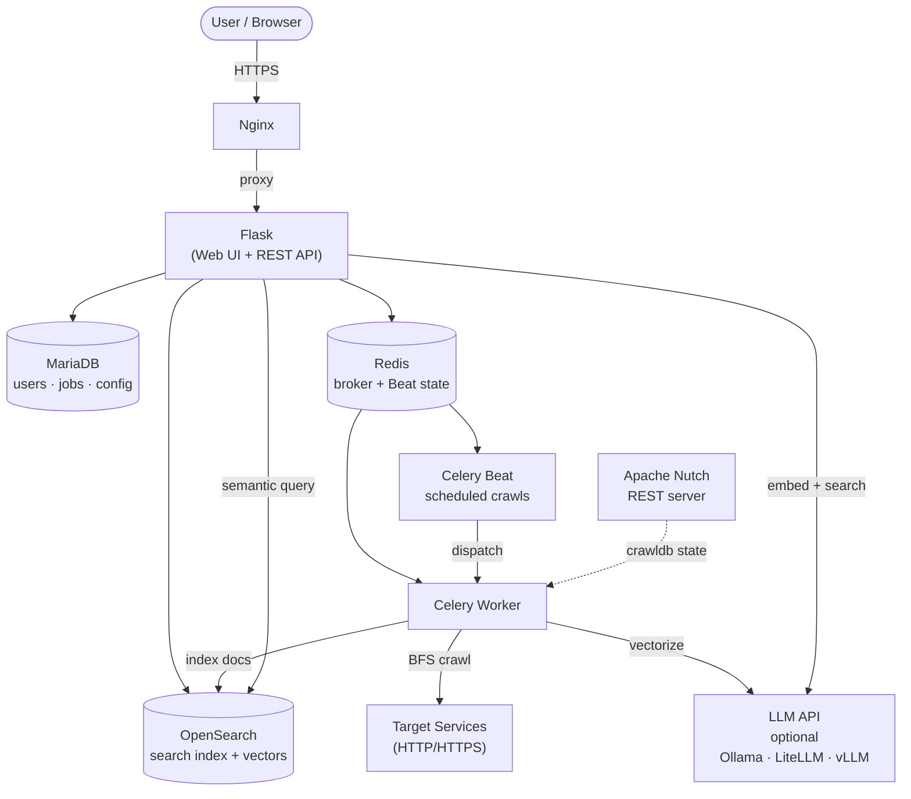

# Self-Hosted Search Engine (SHSE)

**SHSE** is a private, homelab-native search engine. It indexes and searches the services, pages, and content running on your internal network - not the public internet. Full-text BM25 retrieval via OpenSearch, link-following BFS crawling, and optional AI-powered summaries and semantic search via any OpenAI-compatible LLM endpoint.

Admins define what gets crawled via a YAML config file, schedule indexing jobs that run automatically via Celery Beat, and control the index from the admin UI or the CLI. Users get a clean search interface with optional AI-assisted result summaries, semantic matches, and suggested keyword chips - all backed entirely by infrastructure you control.

---

## Features

- **Full-text search** - BM25 multi-field retrieval via OpenSearch with typo tolerance (`fuzziness: AUTO`)
- **Semantic search** - Vector search using local embeddings, loaded async so BM25 results appear immediately
- **Suggested keywords** - Post-search keyword chips extracted from semantic results to help refine queries
- **AI summaries** - Planned (Epic 18); infrastructure is in place but not yet wired to the UI
- **BFS web crawling** - Link-following crawl from a seed URL to configurable depth; depth set per-target in YAML or the admin UI
- **Flexible ingestion** - Service crawl, subnet scan, OAI-PMH harvest, RSS/Atom feed, or custom API adapter
- **Auto-vectorization** - Embeddings backfilled automatically after each successful crawl when LLM API is configured
- **Scheduled indexing** - Cron-style per-target schedules managed by Celery Beat with Redis-backed persistence (redbeat)
- **Job tracking** - Crawl and vectorize jobs visible in the admin Jobs page with live HTMX polling
- **Admin CLI** - `python cli.py` for index stats, search, crawl dispatch, config upload, and job history
- **User accounts** - Per-user search history; role-based access (admin vs. user); light/dark theme toggle
- **SSO support** - Optional OIDC integration (Authentik, Keycloak, Authelia); local password auth on by default

---

## Architecture



### Dependencies

| Service | Role | Required |
|---|---|---|
| OpenSearch | Search index + vector store | Yes |
| MariaDB | Users, history, crawler config, job tracking | Yes |
| Redis | Celery task broker + Beat schedule persistence | Yes |
| Apache Nutch | Web crawler (REST server, auto-starts) | Yes |
| LLM API | Embeddings + AI summaries + semantic search | No |
| Nginx | Reverse proxy / TLS termination | Recommended |
| SSO Provider | OIDC authentication | No |

---

## Getting Started

### Prerequisites

- Docker 24+ and Docker Compose v2
- Git

### Quick Start

1. Clone the repository:
   ```bash
   git clone https://github.com/youruser/shse.git
   cd shse
   ```

2. Copy and edit the environment file:
   ```bash
   cp .env.example .env
   ```

3. Fill in required secrets in `.env`:
   ```ini
   SECRET_KEY=change-me-to-a-random-string
   MARIADB_PASSWORD=your-db-password
   MARIADB_ROOT_PASSWORD=your-root-password
   OPENSEARCH_INITIAL_ADMIN_PASSWORD=Min8Chars1Special!
   ```

4. (Optional) Configure the LLM API for semantic search:
   ```ini
   LLM_API_BASE=http://192.168.1.50:11434/v1
   LLM_EMBED_MODEL=nomic-embed-text
   LLM_GEN_MODEL=granite3.3:latest   # must match a model pulled in your Ollama instance
   ```

5. Start the stack:
   ```bash
   docker compose up -d
   ```

6. Confirm all services are healthy:
   ```bash
   bash init.sh
   ```

7. Log in at `https://localhost:8443` with the default admin credentials:
   - **Username:** `admin`
   - **Password:** `admin`

   You will be redirected to the settings page and prompted to change the password immediately.

See [docs/installGuide.md](docs/installGuide.md) for the full step-by-step installation guide and [docs/docker.md](docs/docker.md) for service details.

---

## Crawler Configuration

Crawl targets are defined in a YAML file uploaded via the admin UI or the CLI.

```yaml
defaults:
  service: http
  port: 80
  route: /
  tls_verify: true
  schedule:
    frequency: weekly
    day: sunday
    time: "02:00"
    timezone: UTC

targets:
  - type: service
    nickname: myblog
    url: blog.homelab.lan
    port: 80
    route: /                  # seed URL path; BFS follows links from here
    crawl_depth: 2            # link hops to follow (0 = seed page only)
    tls_verify: false         # set false for self-signed certs

  - type: network
    network: 192.168.1.0/24

  - type: oai-pmh
    nickname: invenio
    url: invenio.lab.internal
    endpoint: /oai2d

  - type: feed
    nickname: ghost-blog
    url: blog.lab.internal
    feed_path: /rss

  - type: api-push
    nickname: discourse-api
    url: discourse.lab.internal
    adapter: discourse_adapter
```

Any field omitted from a target inherits from the `defaults` block. `crawl_depth` controls how many link-hops the BFS crawler follows from the seed URL; default is `2`. See [docs/config.md](docs/config.md) for the full field reference.

---

## CLI

`cli.py` provides direct access to every admin operation from the terminal. Requires the Docker stack to be running.

```bash
# Index stats
python cli.py stats

# Search
python cli.py search "nginx reverse proxy"
python cli.py search "homelab" --page 2

# Crawler config
python cli.py upload-config config/crawler.example.yaml
python cli.py list-targets

# Crawl operations (dispatches to Celery worker)
python cli.py crawl myblog
python cli.py crawl-all
python cli.py reindex myblog
python cli.py reindex-all --yes

# Index operations
python cli.py vectorize
python cli.py create-index
python cli.py wipe-index --yes

# Job history
python cli.py jobs
python cli.py jobs --limit 50
```

---

## Search API

SHSE exposes a JSON REST API for programmatic search access.

### `GET /api/search`

| Parameter | Type | Default | Description |
|---|---|---|---|
| `q` | string | `""` | Search query |
| `page` | int | `1` | Page number (1-indexed) |
| `tab` | string | `"all"` | Content tab filter |

**Response:**
```json
{
  "q": "nginx",
  "total": 42,
  "took_ms": 8,
  "page": 1,
  "page_count": 5,
  "results": [
    {
      "id": "abc123",
      "title": "Nginx - My Homelab Docs",
      "url": "http://docs.homelab.lan/nginx",
      "service": "homelab-docs",
      "port": 80,
      "crawled_at": "2026-04-25T10:00:00",
      "snippet": "Nginx is a web server that can also be used as a reverse proxy…",
      "vectorized": true
    }
  ],
  "sources": [
    { "name": "homelab-docs", "n": 42 }
  ]
}
```

Returns 200 with empty `results` on any OpenSearch failure.

### `GET /api/stats`

Returns document count, service count, and last crawl timestamp.

```json
{ "docs": 14021, "services": 6, "last_crawl": "2026-04-25T10:00:00" }
```

---

## Authentication

### Local auth (default)

Username and bcrypt-hashed password stored in MariaDB. No configuration required. A default admin account (`admin` / `admin`) is created automatically on first boot. You are prompted to change the password on first login.

### SSO via OIDC (optional)

Set `SSO_ENABLED=true` and configure your provider in `.env`. Any OIDC-compatible provider works. User roles are mapped from the OIDC `groups` claim: members of `SSO_ADMIN_GROUP` (default `admin`) receive the admin role.

See [docs/auth.md](docs/auth.md) for the full route reference and SSO configuration guide.

---

## Roles

| Role | Permissions |
|---|---|
| `admin` | Search, view history, full access to `/admin` |
| `user` | Search, view own history |

---

## Semantic Search and Keyword Chips

When a compatible LLM API is configured (`LLM_API_BASE`), SHSE performs hybrid retrieval at query time:

1. BM25 results render immediately
2. An HTMX request fires for `/api/semantic?q=...` - vector search results and suggested keyword chips load in the right rail without blocking the main results

If the LLM API is unreachable, SHSE falls back to BM25-only results without error and the semantic rail is empty.

> **AI summaries** (RAG-generated answers) are planned but not yet implemented. See Epic 18 in TODO.md.

### Automatic vectorization

After every successful crawl, SHSE automatically dispatches a vectorize job if `LLM_API_BASE` is set. The job appears in the Admin → Jobs page with kind `vectorize`. To trigger it manually:

```bash
python cli.py vectorize
```

### Deferred vectorization

If the LLM API is unavailable during indexing, documents are stored with `vectorized=false` and picked up automatically on the next crawl, or manually via `python cli.py vectorize`. Useful when switching embedding models.

See [docs/llm.md](docs/llm.md) for the full API reference.

---

## Docs

| File | Contents |
|---|---|
| [docs/installGuide.md](docs/installGuide.md) | Step-by-step installation from scratch |
| [docs/usageGuide.md](docs/usageGuide.md) | Day-to-day usage: searching, crawling, admin, CLI |
| [docs/setup.md](docs/setup.md) | Environment config reference and Docker prerequisites |
| [docs/docker.md](docs/docker.md) | Service overview, healthchecks, startup order |
| [docs/guide.md](docs/guide.md) | Operator guide: first run, YAML config, Kiwix test server |
| [docs/config.md](docs/config.md) | YAML crawler config format and field reference (incl. `crawl_depth`) |
| [docs/auth.md](docs/auth.md) | Auth routes, session lifecycle, SSO configuration |
| [docs/database.md](docs/database.md) | Schema, migrations, ERD |
| [docs/opensearch.md](docs/opensearch.md) | Index schema, query shapes, chunking, idempotent upsert |
| [docs/tasks.md](docs/tasks.md) | Celery task signatures, Beat schedule, CrawlJob lifecycle |
| [docs/llm.md](docs/llm.md) | LLM API integration, embedding, RAG flow, fallback |
| [docs/nutch.md](docs/nutch.md) | Nutch REST API reference, TLS patch |
| [docs/search_ui.md](docs/search_ui.md) | Search routes, semantic rail, keyword chips, settings |
| [docs/admin_ui.md](docs/admin_ui.md) | Admin routes, health checks, job management, YAML upload |
| [docs/tls.md](docs/tls.md) | Per-target TLS bypass, global flag, warning banner |
| [docs/nginx.md](docs/nginx.md) | Proxy config, SSL cert setup, `/admin/*` restriction |
| [docs/systemd.md](docs/systemd.md) | Auto-start on boot via systemd |
| [docs/testing.md](docs/testing.md) | Running tests, fixture overview, coverage |

---

## License

MIT
