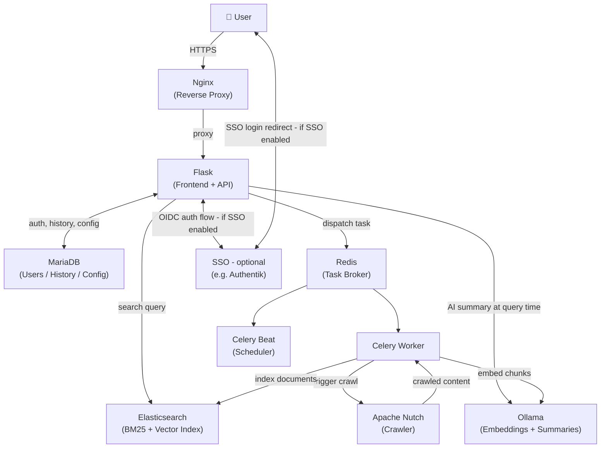

# Self-Hosted Search Engine (SHSE)

> ⚠️ **This project is currently in active development and is not yet production-ready. Expect breaking changes.**

**Self-Hosted Search Engine (SHSE)** is a private, homelab-native search engine designed to index and search the services, pages, and content running on your internal network — not the public internet. Built around Elasticsearch for full-text BM25 retrieval, Apache Nutch for network crawling, and optional Ollama integration for locally-generated AI summaries, SHSE brings the core search experience of early 2000s Google — fast, relevant, no tracking — to your homelab. Admins define what gets crawled via a simple YAML config, schedule indexing jobs through a web UI, and manage the Elasticsearch index without touching the command line. Regular users get a clean search interface with optional AI-assisted result summaries, all backed entirely by infrastructure you control.

---

## Features

- **Full-text search** — BM25 retrieval via Elasticsearch across all indexed homelab content
- **AI summaries** — Optional RAG-based summaries generated by a local Ollama model at query time
- **Flexible crawling** — Crawl entire subnets or define specific services via YAML config
- **Scheduled indexing** — Cron-style crawl schedules per target, managed by Celery Beat
- **Admin UI** — Web interface for managing crawl targets, triggering jobs, and controlling the index
- **User accounts** — Per-user search history; role-based access (admin vs. user)
- **SSO support** — Optional OIDC integration (e.g. Authentik, Keycloak, Authelia); local password auth on by default
- **Fully decomposable** — Every service is independently hostable; co-locate everything or spread across VMs

---

## Architecture

All components are discrete, network-addressable services configured via environment variables. You can run everything on one machine or distribute across your homelab.



### Dependencies

| Service | Role | Required |
|---|---|---|
| Elasticsearch | Search index + vector store | Yes |
| MariaDB | Users, history, crawler config | Yes |
| Redis | Celery task broker | Yes |
| Apache Nutch | Web crawler | Yes |
| Ollama | Embeddings + AI summaries | No |
| Nginx | Reverse proxy / TLS termination | Recommended |
| SSO Provider | OIDC authentication | No |

---

## Getting Started

### Prerequisites

- Docker + Docker Compose
- A running Elasticsearch instance (8.x recommended)
- A running MariaDB instance
- A running Redis instance
- Apache Nutch (REST server mode)
- *(Optional)* Ollama with an embedding model (e.g. `nomic-embed-text`) and a generative model (e.g. `llama3`)

### Quick Start

1. Clone the repository:
   ```bash
   git clone https://github.com/youruser/shse.git
   cd shse
   ```

2. Copy and edit the environment file:
   ```bash
   cp .env.example .env
   ```

3. Configure your service endpoints in `.env`:
   ```ini
   FLASK_HOST=0.0.0.0
   FLASK_PORT=5000

   MARIADB_HOST=192.168.1.10
   MARIADB_PORT=3306

   ES_HOST=192.168.1.20
   ES_PORT=9200

   REDIS_HOST=192.168.1.30
   REDIS_PORT=6379

   NUTCH_HOST=192.168.1.40
   NUTCH_PORT=8080

   OLLAMA_HOST=192.168.1.50
   OLLAMA_PORT=11434

   # SSO — leave SSO_ENABLED=false to use local auth
   SSO_ENABLED=false
   SSO_PROVIDER_URL=https://authentik.homelab.lan
   SSO_CLIENT_ID=
   SSO_CLIENT_SECRET=
   ```

4. Start the stack:
   ```bash
   docker compose up -d
   ```

5. On first run, navigate to `http://<your-host>:5000/setup` to create the initial admin account.

---

## Crawler Configuration

Crawl targets are defined in YAML. Upload or edit this via the admin UI, or mount a file directly.

```yaml
defaults:
  service: http
  port: 80
  route: /
  schedule:
    frequency: weekly
    day: sunday
    time: "02:00"
    timezone: UTC
  tls_verify: true

targets:
  - type: network
    network: 192.168.1.0/24
    schedule:
      frequency: weekly
      day: sunday
      time: "02:00"
      timezone: America/New_York

  - type: service
    nickname: myblog
    url: blog.homelab.lan
    ip: 192.168.1.23
    service: http
    port: 80
    route: /
    tls_verify: false      # set false for self-signed certs
    schedule:
      frequency: monthly
      day: 1
      time: "01:00"
      timezone: America/New_York
```

Any omitted field inherits from the `defaults` block. `tls_verify: false` disables certificate validation for that target — useful for self-signed certs, but not recommended as a permanent global setting. The recommended long-term approach is to add your homelab CA certificate to the Nutch container's JVM trust store.

---

## Admin UI

The admin panel (`/admin`) provides full control over the crawl and index lifecycle.

| Action | Description |
|---|---|
| Crawl this target | Trigger an immediate crawl of a single target |
| Crawl all targets | Trigger an immediate crawl of all configured targets |
| Reindex this target | Delete and rebuild the ES index for a single target |
| Reindex all | Wipe the entire ES index and rebuild from scratch |
| Vectorize deferred docs | Run Ollama embeddings on any documents indexed without a vector |
| Job status | View running and completed crawl jobs |
| System health | Live connectivity status for ES, Nutch, Ollama, Redis |

---

## Authentication

### Local Auth (default)
Username and bcrypt-hashed password stored in MariaDB. Enabled by default; no configuration required. The first admin account is created during initial setup.

### SSO via OIDC (optional)
Set `SSO_ENABLED=true` and provide your provider's URL and client credentials. SHSE supports any OIDC-compatible provider. Tested with Authentik. User roles can be mapped from OIDC group claims or assigned manually by an admin. Local auth can remain active alongside SSO for fallback access.

---

## Roles

| Role | Permissions |
|---|---|
| `admin` | Search, view history, full access to `/admin` |
| `user` | Search, view own history |

---

## AI Summaries

When Ollama is configured, SHSE performs a hybrid retrieval at query time: BM25 results are returned immediately, and a semantic vector search is run in parallel to gather context chunks for the generative model. The summary appears as a card above the standard results, similar to modern search AI overviews.

AI summaries can be toggled per-user in settings. If Ollama is unreachable, SHSE falls back to BM25-only results without error.

### Deferred Vectorization

If Ollama is unavailable during indexing, documents are stored with `vectorized: false`. Once Ollama is back online, use the **Vectorize deferred docs** button in the admin UI to backfill embeddings across the index. This also serves as a re-embed tool if you switch embedding models.

---

## License

MIT